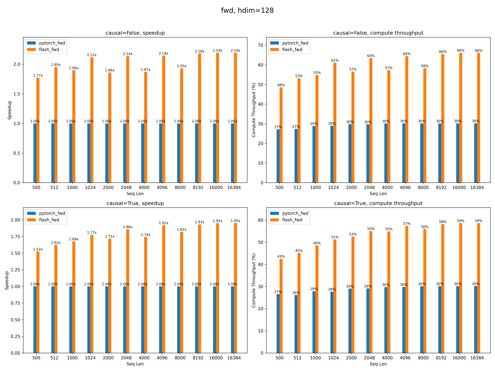
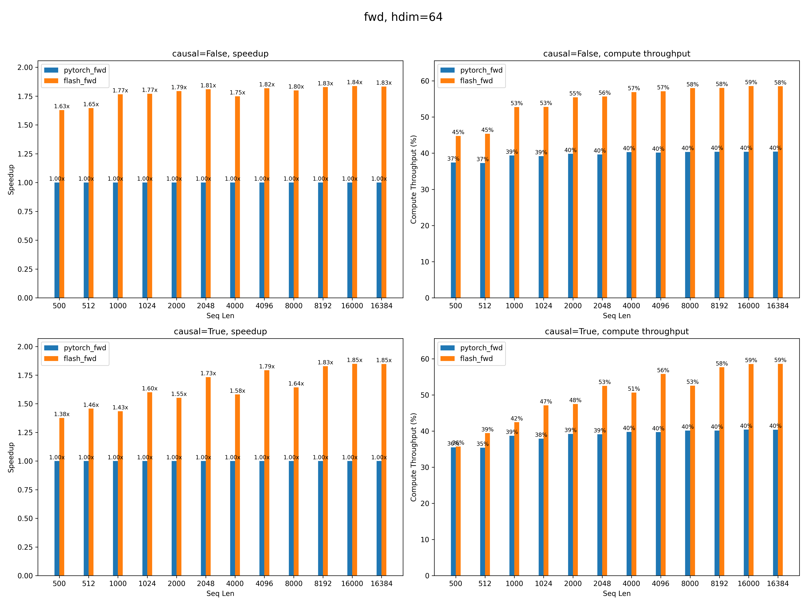
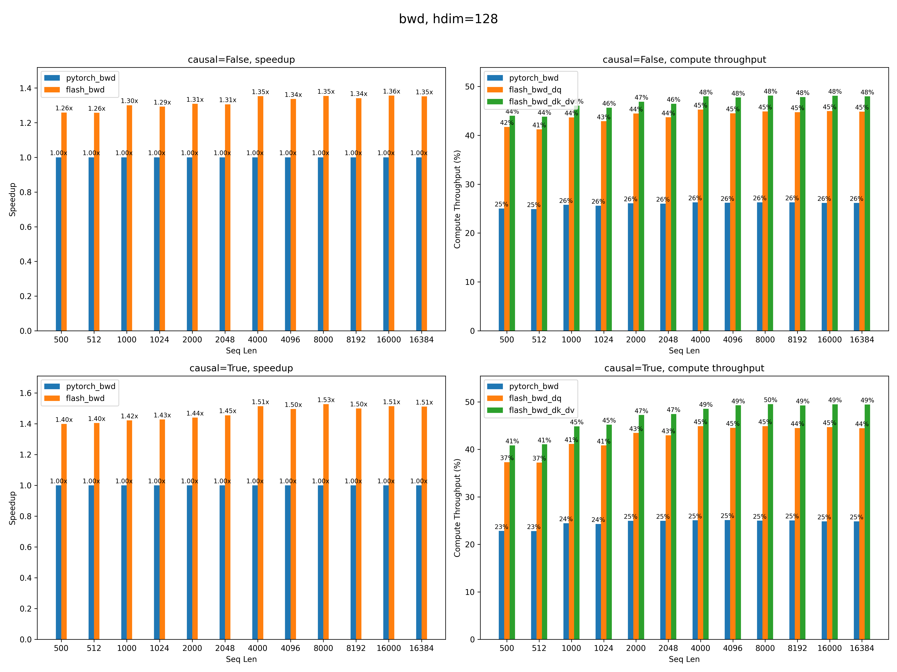
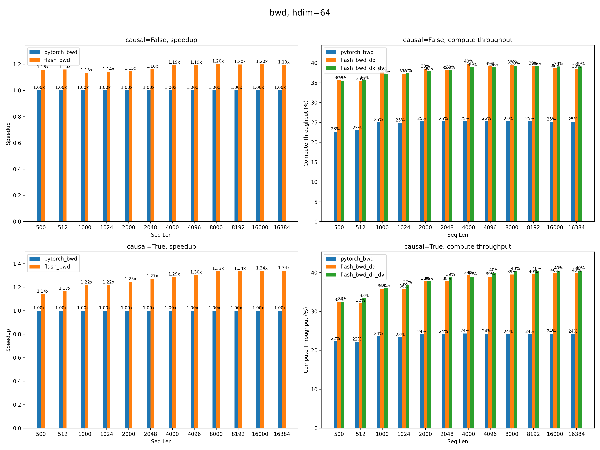

# FlashAttention Turing

This repository provides an implementation of [FlashAttention](https://github.com/Dao-AILab/flash-attention) for the Turing architecture. 

## Features

Supports:

 - fwd and bwd
 - head dim 64, 128
 - causal mask
 - gqa
 - varlen

Does not support:

 - dropout
 - local mask
 - kv cache

## Performance

We currently have benchmarks for T4.

### Forward pass 

Up to 2.19x and 1.95x faster than PyTorch's [Attention](https://pytorch.org/docs/stable/generated/torch.nn.functional.scaled_dot_product_attention.html) for non-causal and causal workloads.

On Turing GPUs, PyTorch's Attention calls Memory-Efficient Attention from [xformers](https://github.com/facebookresearch/xformers) in the backend.

For long sequences, the forward kernel reaches up to 66% compute throughput.




### Backward pass 

The backward pass is split into two kernels: one for `dQ` and one for `dK` and `dV`.

Up to 1.35x and 1.51x faster than PyTorch's Attention for non-causal and causal workloads.

For long sequences, the backward kernels reach up to 49% compute throughput for `dK` and `dV`, and 45% for `dQ`.





## How to use FlashAttention
The main functions implement scaled dot product attention: `softmax(Q @ K^T * softmax_scale) @ V`.

```
from flash_attention_interface import (
    flash_attn_func,
    flash_attn_kvpacked_func,
    flash_attn_qkvpacked_func,
    flash_attn_varlen_func,
    flash_attn_varlen_kvpacked_func,
    flash_attn_varlen_qkvpacked_func,
)
```


The arguments for these functions differ from the standard FlashAttention Python API because this implementation does not support every feature yet. See `turing/flash_attention_interface.py` for the full function signatures and parameter descriptions.


## Requirements
We tested this implementation with:

- CUDA 12.4
- PyTorch 2.8.0 and 2.5.1

## Build notes

Install with:

```bash
git clone https://github.com/ssiu/flash-attention-turing
cd /path/to/flash-attention-turing
pip install torch setuptools ninja wheel
pip install -v .
```

To run the test suite, install the test dependencies:

```bash
pip install pytest numpy pandas
pytest -q
```

If you enable Excel debug dumps in `test_flash_attn.py`, also install:

```bash
pip install openpyxl
```
